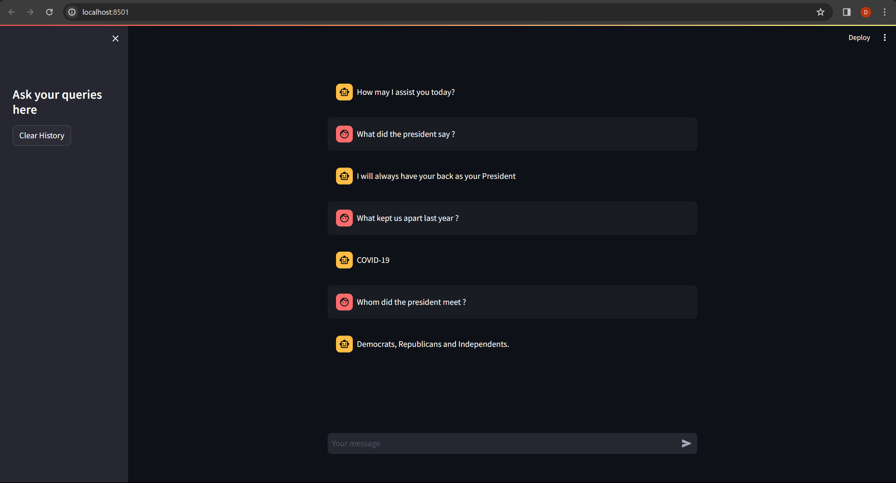

# Langchain Application

Created a Question Answering application using Streamlit, FastAPI and Langchain.

## Setup

1. Create a `.env` file in the backend directory and set your `HUGGINGFACEHUB_API_TOKEN` inside it.
2. Initialize document store and create a FAISS index using `backend/document_store/initialize.py`or use `backend/document_store/initialize.ipynb` if you want to parallely explore the code.

## For running the app Using Docker

### 1. Using docker compose
Cd into the repo and run `docker compose up`

### 2. Using docker commands
1. Cd into into the `backend` dir and run the following commands in order `docker build -t backend:v1 .` and `docker run -it -p 8000:8000 backend:v1`. 
2. Cd into into the `frontend` dir and run the following commands in order `docker build -t frontend:v1 .` and `docker run -it -p 8501:8501 frontend:v1`.
3. Now, the backend should be available at `localhost:8000` and the swagger documentation can be seen at `localhost:8080/docs`

## For running the app locally without docker.

1. Cd into the repo and install the dependencies using `requirements.txt` located at the root.
2. In a terminal `cd frontend`, edit config.py to  `BACKED_URL = "http://localhost:8000/chat"`  and run `streamlit run Home.py`
3. Use another terminal to `cd backend` and run `uvicorn main:app --reload`
4. Frontend should be available at `localhost:8501` 
5. Backend should be available at `localhost:8000` and the swagger documentation can be seen at `localhost:8080/docs`

## Frontend
Once the appliation is hosted succesfully, it can be accessed at `localhost:8501`:

